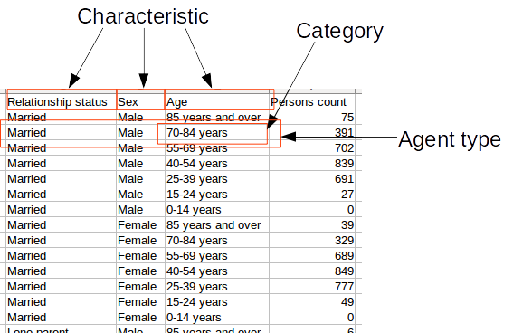

# FreeSyn
Application independent sample free population synthesis framework

This is a heuristic method for synthesising agent populations using survey data. This was partially funded by [Life Time Affordable and Tennable City Housing (LATCH)](https://rmit-tst4.aws.rmit.edu.au/research/research-institutes-centres-and-groups/research-centres/centre-for-urban-research/projects/current-projects/lifetime-affordable-and-tenable-city-housing/about) project .

## About

This is a software for synthsising agent populations using data sources like surveys and census. Significances of this project are:
 1. Do not rely on sample data (microdata)
 2. Uses a novel framework capture population heuristics in a generic manner allowing the software to be used to generate different populations simply by changing the inputs. A feature that other sample free population synthesis methods do not have, to the best of our knowledge.
 
 The program has two main parts:
 1. A framework to capture population heuristics in a generic manner
 2. A population synthesis algorithm that uses Iterative Proportional Fitting, Monte Carlo Sampling and Hill Climbing Optimisation.
 
The purpose of the framework is decoupling the algorithm and application specific heuristics by providing a structured interface. Sample free population synthesis algorithms that we have seen in the literature have heuristics hardcoded into the algorithm. This makes them hard to use in different applications other than what they are initial designed for. We avoid this problem by decoupling the heuristics from the algorithm as mentioned earlier. The algorithm implemented here acts on the constructs of the framework when synthesising the population rather than directly on the heuristics. This allows us to change the input heuristics independently for different applications without having to change the algorithm code.

Full description of the underlying framework and the algorithm is available at `doc/full algorithm.pdf`. This paper will soon appear in [Journal of Artificial Societies and Social Simulation (JASSS)](http://jasss.soc.surrey.ac.uk/JASSS.html).

## Special Terms

Data distribution - This is a categorical data distribution giving the number of persons or households (family) under different person or household categories. Usually a data distribution comes in tabular form from a survey or a census database.

*Characteristic* - is a distribution of households or persons in the population. e.g. number of persons by gender distribution, number of households by household sizes

*Category*- 'Male' and 'Female' are examples for categories in number of persons by gender population charactristic

*Agent type / group type* - Is a cohort of agents (persons) or groups (households) based on a combination of categories. 

  

